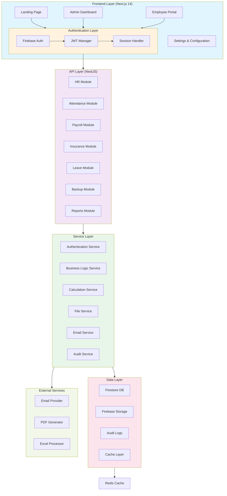
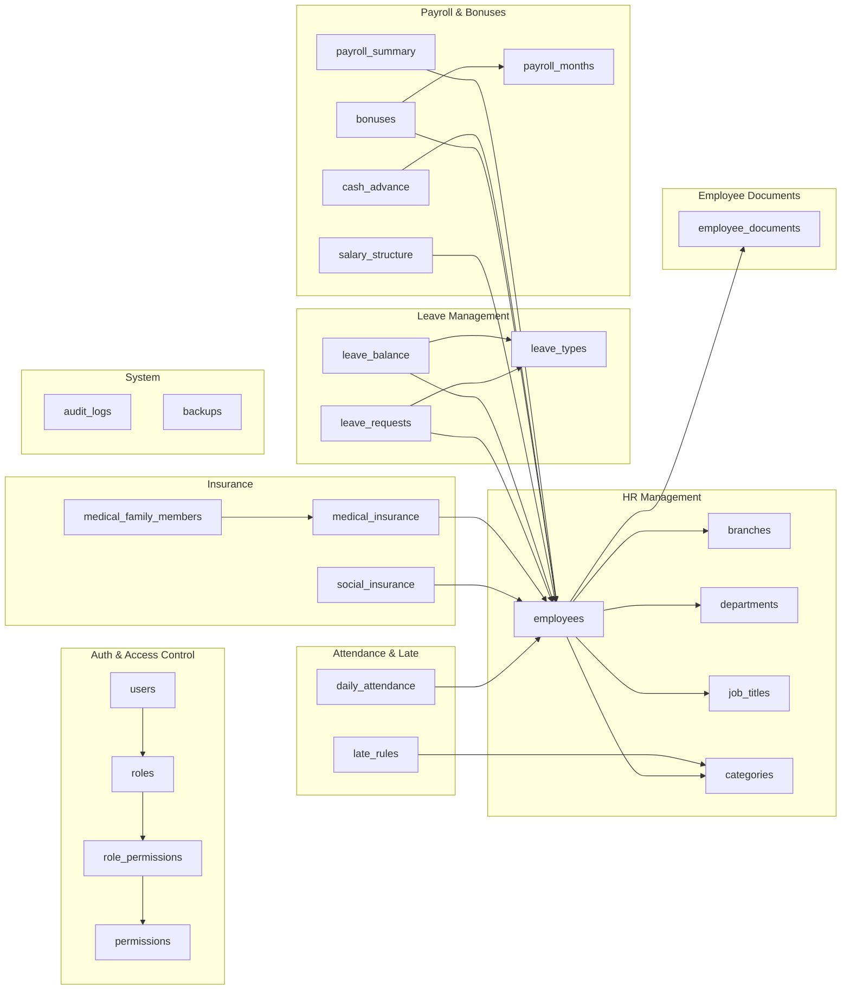
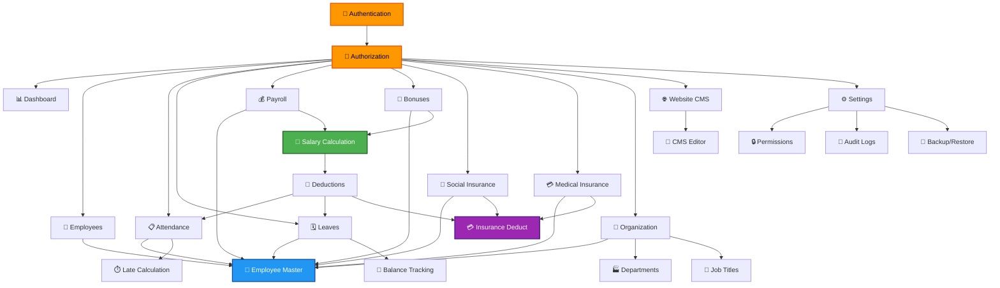

# PHASE 1: ARCHITECTURE DESIGN - HR ERP & PAYROLL SYSTEM

## Project Overview
Enterprise HR Management System for multi-branch nursery with complete HR, Payroll, and Insurance management.

---

## System Workflow Overview

```
Browser (Next.js Frontend)
    ↓
Firebase Authentication (Login/OAuth)
    ↓
Next.js Application
    ├── Admin Dashboard (HR staff)
    ├── Employee Portal
    └── Public Landing Page
    ↓
JWT Token
    ↓
Backend API (NestJS) - REST Endpoints
    ├── /auth (Login, Register, Password Reset)
    ├── /branches (CRUD)
    ├── /departments (CRUD)
    ├── /employees (CRUD, Profile, Documents)
    ├── /attendance (Daily tracking, Reports)
    ├── /leave (Requests, Balance, History)
    ├── /payroll (Calculations, Slips, Reports)
    ├── /insurance (Social, Medical, Coverage)
    ├── /bonuses (Entry, Calculation)
    ├── /backup (Manual, Restore)
    └── /reports (Excel export, PDF generation)
    ↓
Database Layer
    ├── Firebase Firestore (Primary Real-time DB)
    ├── Firebase Storage (Employee Documents)
    ├── PostgreSQL (Optional backup)
    └── Audit Logs Collection
    ↓
External Services
    ├── Firebase Auth
    ├── Email Service (SendGrid/Nodemailer)
    ├── PDF Generation (PDFKit)
    ├── Excel Processing (ExcelJS)
    └── Cloud Storage (Firebase Storage)
```

---

## System Architecture Diagram



---

## Database Schema Architecture



---

## API Endpoints Structure (60+ Endpoints)

```
Authentication
├── POST /auth/register              (Public)
├── POST /auth/login                 (Public)
├── POST /auth/google-login          (Public)
├── POST /auth/logout                (Protected)
├── POST /auth/refresh-token         (Protected)
└── POST /auth/reset-password        (Public)

Dashboard
├── GET /dashboard/overview          (Protected) - KPIs and metrics
├── GET /dashboard/analytics         (Protected) - Charts data
├── GET /dashboard/quick-actions     (Protected) - Quick actions
└── GET /dashboard/health            (Protected) - System health

Employees
├── POST /employees                  (Admin) - Create employee
├── GET /employees                   (Protected) - List with filters
├── GET /employees/:id               (Protected) - View profile
├── PUT /employees/:id               (Protected) - Update profile
├── DELETE /employees/:id            (Admin) - Archive employee
├── POST /employees/:id/documents    (Protected) - Upload docs
├── GET /employees/:id/documents     (Protected) - View documents
├── POST /employees/import           (Admin) - Bulk import
└── POST /employees/export           (Admin) - Bulk export

Attendance
├── POST /attendance/checkin         (Employee) - Check-in
├── POST /attendance/checkout        (Employee) - Check-out
├── GET /attendance                  (Protected) - View records
├── GET /attendance/report           (Admin) - Department report
├── PUT /attendance/:id              (Admin) - Correct attendance
├── GET /attendance/monthly          (Admin) - Monthly report
└── POST /attendance/import          (Admin) - Bulk import

Leaves
├── POST /leaves/requests            (Employee) - Apply for leave
├── GET /leaves/requests             (Protected) - View requests
├── PUT /leaves/requests/:id/approve (HR) - Approve leave
├── PUT /leaves/requests/:id/reject  (HR) - Reject leave
├── GET /leaves/balance/:empId       (Employee) - Check balance
├── GET /leaves/history              (Employee) - View history
├── GET /leaves/types                (Protected) - Leave types
└── GET /leaves/report               (Admin) - Leave report

Payroll
├── POST /payroll/months             (Admin) - Create month
├── GET /payroll/months              (Admin) - List months
├── PUT /payroll/months/:id          (Admin) - Update month
├── GET /payroll/summary             (Admin) - Payroll summary
├── GET /payroll/slips/:empId        (Protected) - View salary slip
├── POST /payroll/calculate          (Admin) - Calculate payroll
├── POST /payroll/finalize           (Admin) - Finalize month
└── POST /payroll/export             (Admin) - Export payroll

Bonuses
├── POST /bonuses                    (HR) - Add bonus entry
├── GET /bonuses                     (Protected) - View bonuses
├── GET /bonuses/:month              (HR) - View monthly bonuses
├── PUT /bonuses/:id                 (HR) - Update bonus
├── DELETE /bonuses/:id              (HR) - Delete bonus
├── GET /bonuses/history/:empId      (Employee) - Employee bonus history
└── GET /bonuses/report              (Admin) - Bonus report

Social Insurance
├── POST /insurance/social           (Admin) - Enroll employee
├── GET /insurance/social            (Admin) - View enrollments
├── PUT /insurance/social/:empId     (Admin) - Update enrollment
├── GET /insurance/social/:empId     (Protected) - View personal coverage
├── POST /insurance/social/premiums  (Admin) - Calculate premiums
└── GET /insurance/social/report     (Admin) - Social insurance report

Medical Insurance
├── POST /insurance/medical          (Admin) - Create medical plan
├── GET /insurance/medical           (Admin) - View plans
├── PUT /insurance/medical/:id       (Admin) - Update plan
├── POST /insurance/medical/enroll   (Admin) - Enroll employee
├── POST /insurance/medical/family   (Employee) - Add family member
├── GET /insurance/medical/:empId    (Protected) - View coverage
└── GET /insurance/medical/report    (Admin) - Medical insurance report

Organization
├── Branches
│   ├── GET /organization/branches           (Admin)
│   ├── POST /organization/branches          (Admin)
│   ├── PUT /organization/branches/:id       (Admin)
│   ├── DELETE /organization/branches/:id    (Admin)
│   └── POST /organization/branches/export   (Admin)
├── Departments
│   ├── GET /organization/departments        (Admin)
│   ├── POST /organization/departments       (Admin)
│   ├── PUT /organization/departments/:id    (Admin)
│   ├── DELETE /organization/departments/:id (Admin)
│   └── POST /organization/departments/import (Admin)
├── Job Titles
│   ├── GET /organization/job-titles         (Admin)
│   ├── POST /organization/job-titles        (Admin)
│   ├── PUT /organization/job-titles/:id     (Admin)
│   └── DELETE /organization/job-titles/:id  (Admin)
└── Categories
    ├── GET /organization/categories         (Admin)
    ├── POST /organization/categories        (Admin)
    ├── PUT /organization/categories/:id     (Admin)
    └── DELETE /organization/categories/:id  (Admin)

Website CMS
├── GET /cms/pages                   (Public) - List published pages
├── GET /cms/pages/:slug             (Public) - Get page content
├── POST /cms/pages                  (Admin) - Create page
├── PUT /cms/pages/:id               (Admin) - Update page
├── DELETE /cms/pages/:id            (Admin) - Delete page
├── POST /cms/pages/:id/publish      (Admin) - Publish page
├── POST /cms/images/upload          (Admin) - Upload image
└── GET /cms/images                  (Admin) - List images

Settings
├── GET /settings                    (Admin) - Get all settings
├── PUT /settings                    (Admin) - Update settings
├── POST /settings/branding          (Admin) - Update branding
├── GET /settings/branding           (Protected) - Get branding
├── POST /settings/backup            (Admin) - Manual backup
├── GET /settings/backup/list        (Admin) - List backups
├── POST /settings/backup/restore    (Admin) - Restore backup
├── GET /settings/audit-logs         (Admin) - View audit logs
├── POST /users                      (Admin) - Create user
├── GET /users                       (Admin) - List users
├── PUT /users/:id                   (Admin) - Update user
└── DELETE /users/:id                (Admin) - Deactivate user
```

---

## Module Dependencies (11 Modules)



---

## Security Architecture

```
┌─────────────────────────────────────────────────────┐
│                  SECURITY LAYERS                    │
└─────────────────────────────────────────────────────┘

1. AUTHENTICATION LAYER
   ├── Firebase Auth (Social Login + Email/Password)
   ├── JWT Token Generation & Validation
   ├── Refresh Token Management
   └── Session Management (HttpOnly Cookies)

2. AUTHORIZATION LAYER
   ├── Role-Based Access Control (RBAC)
   ├── Permission Matrix
   ├── Resource-Level Authorization
   └── API Endpoint Guards

3. DATA SECURITY LAYER
   ├── AES-256 Encryption (Sensitive Fields)
   │  └── National IDs, Medical Info
   ├── bcrypt Password Hashing (Cost: 10)
   ├── Field-Level Encryption Rules
   └── Secure Deletion Policies

4. INPUT VALIDATION LAYER
   ├── DTO Validation (class-validator)
   ├── Zod Schema Validation
   ├── SQL Injection Prevention
   ├── XSS Prevention
   └── CSRF Token Protection

5. AUDIT & LOGGING LAYER
   ├── All Data Modifications Logged
   ├── User Action Tracking
   ├── Failed Access Attempt Logging
   ├── Sensitivity Level Classification
   └── 90-Day Log Retention

6. NETWORK SECURITY
   ├── HTTPS/TLS Enforcement
   ├── CORS Configuration
   ├── Rate Limiting (100 req/min/IP)
   ├── DDoS Protection
   └── API Key Rotation

7. DATABASE SECURITY
   ├── Firebase Security Rules
   ├── Row-Level Security
   ├── Encryption at Rest
   ├── Automated Backups
   └── Access Control Lists
```

---

## Deployment Architecture

```
┌─────────────────────────────────────────────────────────┐
│                   DEPLOYMENT STACK                      │
└─────────────────────────────────────────────────────────┘

FRONTEND (Vercel)
├── Next.js Application
├── Automatic Deployment from main branch
├── Edge Functions for API calls
├── CDN Distribution
├── Environment: NEXT_PUBLIC_API_URL
└── SSL/TLS Automatic

BACKEND (Railway/Render)
├── Docker Container (Node.js 20)
├── Environment Variables (Firebase Keys)
├── Auto-scaling enabled
├── Health checks every 30s
├── Restart policy: always
└── Log aggregation

DATABASE (Firebase)
├── Firestore Collections
├── Automatic Replication (3 regions)
├── Point-in-time Recovery enabled
├── Automated Daily Backups
├── Security Rules Applied
└── Real-time Sync enabled

STORAGE (Firebase Storage)
├── Employee Documents
├── Backup Files
├── PDF Reports
├── Secure Access Control
└── Versioning enabled

MONITORING & LOGGING
├── Sentry for Error Tracking
├── Firebase Analytics
├── Custom Logging Service
├── Email Alerts on Errors
└── Dashboard for metrics
```

---

## Key Features by Phase

| Phase | Feature | Status |
|-------|---------|--------|
| 1 | Architecture & Design | ✅ Planning |
| 2 | Landing Page + Branding | ⏳ Next |
| 3 | Project Setup | ⏳ Next |
| 4 | Authentication System | ⏳ Next |
| 5 | Database Schema | ⏳ Next |
| 6 | Backend API (NestJS) | ⏳ Next |
| 7 | Frontend (Next.js) | ⏳ Next |
| 8 | Business Logic | ⏳ Next |
| 9 | Excel Import/Export | ⏳ Next |
| 10 | Backup System | ⏳ Next |
| 11 | Deployment | ⏳ Next |

---

## Technology Versions & Dependencies

### Frontend Stack
```json
{
  "next": "^14.0.0",
  "react": "^18.2.0",
  "typescript": "^5.3.0",
  "tailwindcss": "^3.4.0",
  "@shadcn/ui": "latest",
  "react-query": "^3.39.0",
  "zustand": "^4.4.0",
  "react-hook-form": "^7.48.0",
  "zod": "^3.22.0"
}
```

### Backend Stack
```json
{
  "nestjs": "^10.3.0",
  "firebase-admin": "^12.0.0",
  "class-validator": "^0.14.0",
  "class-transformer": "^0.5.0",
  "typescript": "^5.3.0",
  "bcrypt": "^5.1.1",
  "jsonwebtoken": "^9.1.2",
  "exceljs": "^4.3.0",
  "nodemailer": "^6.9.0"
}
```

---

## Next Steps - Phase 2

In Phase 2, we will:
1. ✅ Create **Landing Page** with hero section
2. ✅ Add **Feature cards** with icons
3. ✅ Build **Branding** system
4. ✅ Create **CMS-style editor** for content
5. ✅ Configure **Database connections**
6. ✅ Generate initial **Next.js project** structure

---

**Status:** ✅ Phase 1 Complete - Ready for Phase 2
**Total Project Complexity:** Enterprise (High)
**Estimated Timeline:** 12-16 weeks (with this automated approach)
